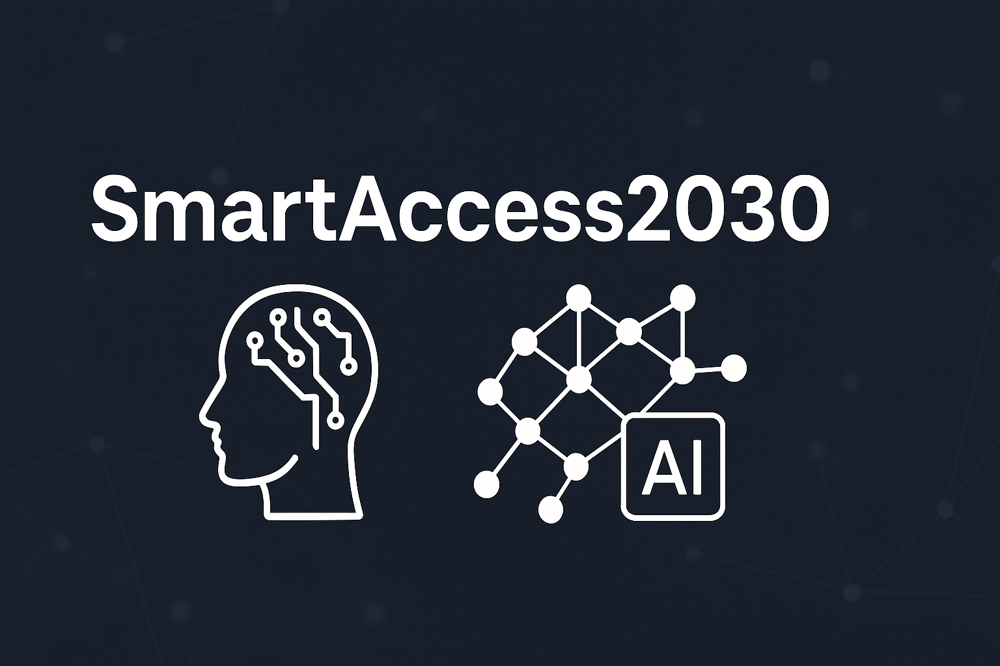

<p align="center">
  
</p>


---

## 🎯 Présentation du projet

### 🔐 **SmartAccess2030 — Système Intelligent de Contrôle d’Accès pour l’Industrie 4.0**

**SmartAccess2030** est une solution innovante de **contrôle d’accès intelligent** et de **traçabilité en temps réel**, spécialement conçue pour les environnements industriels modernes.

Elle repose sur une architecture technologique combinant **Intelligence Artificielle**, **Big Data**, et **traitement de flux temps réel** afin d’optimiser la sécurité, la supervision et l’efficacité opérationnelle.

---

### 🚀 Fonctionnalités clés :

- 🔐 **Authentification multimodale** : badge, reconnaissance **vocale (Whisper)**, reconnaissance **faciale (OpenCV)**
- ⚡ **Traitement en temps réel** via **Apache Kafka** et **Spark Streaming**
- 🔍 **Indexation des événements** dans **Elasticsearch**
- 📊 **Tableaux de bord dynamiques** avec **Power BI**
- 🗂️ **Archivage automatisé** des accès et alertes critiques

---

🎯 **Objectif** : offrir une solution complète et intelligente pour **sécuriser, tracer et piloter** les flux d’accès au sein d’une infrastructure industrielle, dans le respect des principes de l’**Industrie 4.0**.

---


## 📁 Structure
- `src/` : Code principal
- `scripts/` : Scripts de lancement
- `docker/` : Conteneurs Kafka + Elasticsearch
- `notebooks/` : Analyses exploratoires
- `data/` : Données brutes et traitées
- `models/` : Modèles IA (Whisper, etc.)

## 🚀 Installation

```bash
git clone https://github.com/<ton_user>/SmartAccess2030.git
cd SmartAccess2030
python3 -m venv env
source env/bin/activate
pip install -r requirements.txt
